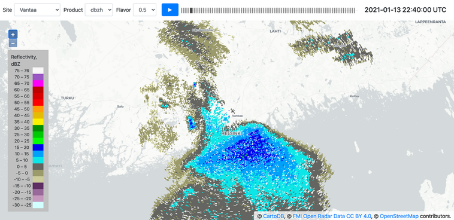

# radar-display

This is a proper weather radar product display, in the browser. (This also
needs a snazzier name.)



There's a deployment running at https://radar.a3h.net/ that displays
[FMI](https://www.fmi.fi/)'s PPI reflectivity products for individual radars.

Features
- reprojection
- coloring
- product animation
- decent base map
- keyboard shortcuts (SPACE, LEFT, RIGHT, S, P, F)

Future plans
- rudimentary cursor tool (show value under cursor)
- product metadata display (PRF etc)
- rendering optimizations
- range rings
- more products (or moments, e.g. radial velocity)
- more color scales
- different animation speeds
- time rather than product based animation
- atmospheric pressure data overlay
- other than FMI data (NEXRAD?)

Known issues
- doesn't switch to latest product when new one arrives automatically when
  stopped on the last visible time step
- animation state doesn't currently survive page refresh
- does unnecessary product loads at initialization


## Components

There are three main components:
1. product downloader (only for FMI right now),
2. distribution collector (collects downloaded products, saves them for web distribution),
3. client software (JavaScript single page app written in modern JS; React, Redux, OpenLayers)


## Create deployment

```
cd client
make clean && make
cd ..
mkdir -p client/build/radar
python fmi/dist_builder/collect_radar_products.py /path/to/where/you/downloaded/the/stuff | \
    python collect.py fmi/dist_builder/raster_to_json.py client/build/data
cd client
make
```


## Thoughts and ideas

- Line density display:
   https://twitter.com/archillect/status/938533533810937856
 - FMI summer color scale for reflectivity
   http://wms.fmi.fi/fmi-apikey/<>/geoserver/Radar/ows?service=WMS&request=GetLegendGraphic&format=image%2Fpng&width=500&height=100&layer=anjalankoski_dbzh&style=Radar+dbz+Summer
   - From QGIS coloring, should look at the above legend graphic instead
     ```
     FMI reflectivity (summer)
     0 => 255, 255, 255   (nodata)
     21 => 108, 235, 243  (kohtalainen)
     62 => 65, 154, 90    (kohtalainen)
     84 => 241, 243, 90   (sakea)
     168 => 206, 2, 2     (sakea)
     189 => 131, 10, 70   (hyvin sakea)
     251 => 244, 244, 244 ()
     ```
 - Smoothing where every value around is some data value and the value in the
   point is not scanned or no echo.


## Licensing

[GPLv3](LICENSE)
